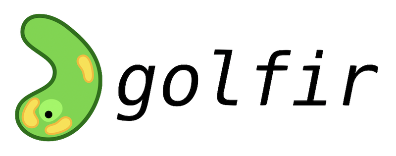

.. image:: https://zenodo.org/badge/DOI/10.5281/zenodo.7149516.svg
   :target: https://doi.org/10.5281/zenodo.7149516
   
``golfir``: Great Observatories Legacy Fields IR Analysis Tools
~~~~~~~~~~~~~~~~~~~~~~~~~~~~~~~~~~~~~~~~~~~~~~~~~~~~~~~~~~~~~~~
This repository provides tools for modeling Spitzer IRAC and MIPS images based on high resolution templates from existing Hubble imaging in the context of the CHArGE / GOLF project (Brammer, Stefanon et al.).

Requirements: 
~~~~~~~~~~~~~
    .. code:: 
    
       grizli (https://github.com/gbrammer/grizli)
       skimage
       astropy
       drizzlepac
       photutils
       ...
       
Installation:
~~~~~~~~~~~~~

    .. code:: bash
    
        $ pip install golfir

    .. code:: bash
    
        $ git clone git@github.com:gbrammer/golfir.git
        $ cd golfir
        $ pip install . -r requirements.txt
        
Usage:
~~~~~~
See the examples in the `notebooks` subdirectory:

- `IRAC-mosaic.ipynb <https://github.com/gbrammer/golfir/blob/master/notebooks/IRAC-mosaic.ipynb>`__ - Generate drizzled IRAC mosaics and PSFs from individual Spitzer `BCD` exposure files.
- `IRAC-photometry.ipynb <https://github.com/gbrammer/golfir/blob/master/notebooks/IRAC-photometry.ipynb>`__ - Extract Spitzer photometry using HST template images similar to Mophongo (Labb\'e et al.), T-PHOT (Merlin et al.), etc.
 
